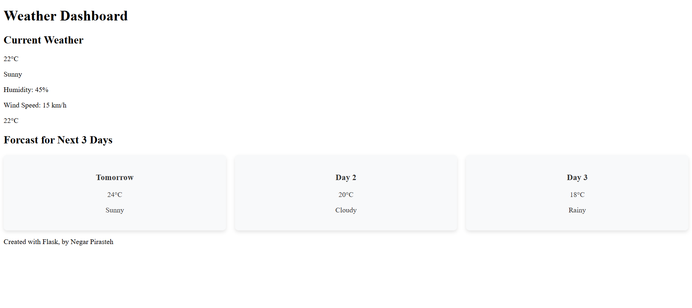

# Flask Weather Forecast Web App 🌡️☁️

A simple weather forecast web application built with Flask using Python. This application provides the current weather conditions and a 3-day weather forecast, with information such as temperature, weather condition, humidity, and wind speed. The frontend is designed with a minimalist layout using HTML and CSS.

## Features

- **Current Weather**: Displays the current temperature, weather conditions, humidity, and wind speed.
- **3-Day Forecast**: Shows the forecast for the next three days, including temperature and weather conditions.
- **Dynamic Styling**: Changes temperature display styles based on conditions (e.g., hot, cold).

## Technologies Used

- **Python**: The main programming language for the backend.
- **Flask**: A lightweight web framework for handling server requests and rendering HTML.
- **HTML & CSS**: For structuring and styling the frontend.
- **Weather API**: (Optional) Integrates with a weather API to fetch real-time weather data.

## Getting Started

### Prerequisites

- **Python 3.x** installed on your machine.
- Basic knowledge of Python and Flask.

### Installation

1. **Clone the repository:**
   ```bash
   git clone https://github.com/negarprh/flask_weather_app.git
   cd flask_weather_app
   ```

2. **Set up a virtual environment:**
   ```bash
   python3 -m venv venv
   source venv/bin/activate  # For macOS/Linux
   venv\Scripts\activate     # For Windows
   ```

3. **Install the required dependencies:**
   ```bash
   pip install -r requirement.txt
   ```

4. **Get API Key** (if using a weather API):
   - Sign up at [OpenWeatherMap](https://openweathermap.org/) or any other weather API provider.
   - Replace the placeholder API key in the code with your actual API key.

5. **Run the application:**
   ```bash
   flask run
   ```

6. **Access the app**:
   - Open your browser and go to `http://127.0.0.1:5000`.

### Project Structure

```plaintext
flask_weather_app/
├── .venv/                 # Virtual environment files
├── static/
│   └── style.css          # CSS file for styling
├── templates/
│   ├── base.html          # Base HTML template
│   └── weather.html       # Weather display template
├── main.py                # Main Flask application file
├── README.md              # Project documentation
└── requirement.txt       # Project dependencies
```

## Usage

1. Launch the application and view the current weather on the home page.
2. The app displays the current temperature, weather conditions, humidity, and wind speed.
3. A 3-day forecast section provides temperature and weather conditions for the next three days.

## Screenshots

### Website Preview


## Contributing

Contributions are welcome! If you have ideas for new features or improvements, please fork the repository and submit a pull request.

## License

This project is licensed under the MIT License.

## Acknowledgments

- [Flask Documentation](https://flask.palletsprojects.com/)
- [OpenWeatherMap API](https://openweathermap.org/) for providing weather data (if applicable)


